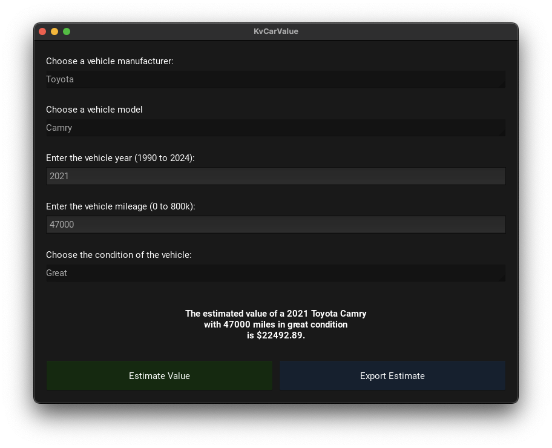
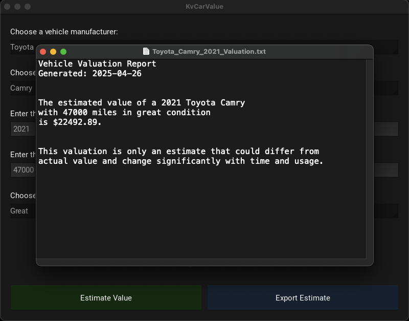
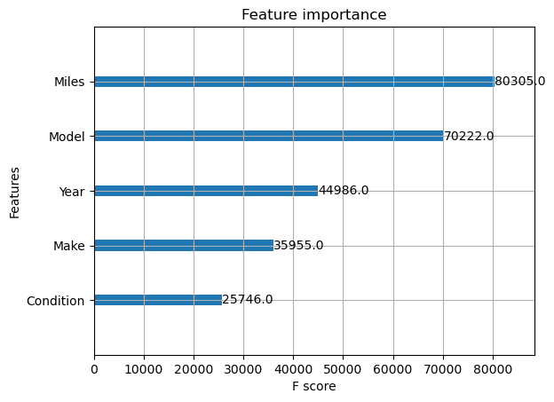

# Car Value Estimation App

Lightweight, fully local Python desktop application for estimating vehicle resale values based on make, model, year, mileage, and condition.

Built using Kivy for native-style UI development, ONNX Runtime for fast machine learning inference, and a custom-trained model on synthetic vehicle data.

---

## Overview

This project delivers a cross-platform desktop application capable of estimating used vehicle resale values based on user inputs.

It demonstrates a full machine learning workflow from synthetic data generation and custom ML model training to lightweight cross-platform deployment via a native-style desktop app.

It also highlights how compact AI utilities can be developed and delivered locally, supporting early prototyping, user acceptance testing, or standalone ML-powered tools before bringing in heavy cloud infrastructure.

Beyond deployment, the project emphasizes realistic data simulation, efficient model packaging, and streamlined UX, key elements of accessible AI/ML systems.

---

## Application Download

A pre-built macOS application bundle (`.app`) is available for download from the [Releases](../../releases) section.

<p align="center">
  
</p>
<p align="center"><em>Figure: Application icon for the packaged macOS app.</em></p>


> To run the app on macOS for the first time, you may need to manually approve it in **System Settings → Privacy & Security** (*see detailed instructions below*).

---

## Features
- User inputs: Make, Model, Year, Mileage, Condition
- Real-time car value prediction using an ONNX-optimized boosted tree regressor
- Fully local inference — no internet connection required after installation
- Dynamic dropdowns that update available models based on selected manufacturer with responsive hover state
- Generate and export valuation reports (`.txt` format)
- Native macOS-style interface using Kivy framework
- Custom application icon and lightweight desktop app packaging
- End-to-end workflow: synthetic data generation → model training → ONNX export → cross-platform desktop deployment

## Application Interface

The desktop application features a clean, native-style interface where users can enter vehicle details, including make, model, year, mileage, and condition, to receive an instant valuation.  

The app incorporates dynamic dropdowns that update available models based on the selected manufacturer, custom hover behaviors for greater visual feedback, and adaptive layout across common window dimensions.

The example below shows the application with fields populated and an estimated vehicle value displayed.

<p align="center">
  
</p>
<p align="center"><em>Figure: Example of the application interface with user input and predicted valuation displayed.</em></p>


---


## Example Report Export

Users can generate and export vehicle valuation reports as `.txt` files.  

Each report includes the report generation date, the estimated vehicle value, and the input parameters described in plain language.


<p align="center">
  
</p>
<p align="center"><em>Figure: Example of an exported vehicle valuation report.</em></p>

---


## Model Development

The vehicle value prediction model was trained on a dataset of approximately 114,000 entries containing vehicle specifications and historical resale values.

### Preprocessing
- Input features included: **Make**, **Model**, **Year**, **Miles**, and **Condition**.
- **Condition** was mapped from string labels to integers (e.g., Poor → 1, Like New → 6).
- **Make** and **Model** were integer-encoded rather than one-hot encoded, as experimental results showed only a marginal improvement (~0.5% in MAPE) with one-hot encoding.
  - This simplification maintained a clean feature space without significant performance degradation.
  - Model IDs were mapped into integer ranges (100–327), and cardinality did not present issues for model training.

### Training
- The dataset was split into a **training set** (85%, ~96,900 samples) and a **testing set** (15%, ~17,100 samples).
- The model was trained using **XGBoost Regressor** with hyperparameters:
  - Learning rate (`eta`): 0.12
  - Maximum tree depth: 13

### Evaluation
- Final model performance:
  - **1.3% Mean Absolute Percentage Error (MAPE)** (~98.7% average prediction accuracy).
  - **R² Score:** 0.9989
  - **Mean Absolute Error (MAE):** \$142.09
  - **Root Mean Squared Error (RMSE):** \$306.62

- Feature importance (F-score) indicated:
  - **Miles** and **Model** were the dominant predictors
  - **Year**, **Make**, and **Condition** were secondary factors.

The model demonstrates strong predictive performance, achieving low average errors (MAPE 1.3% or MAE $142), high prediction-to-actuals fit (R² ~0.999), and stable cross-validation results (MAPE 5.9%). Occasional larger errors (RMSE ~2.1x MAE) correspond to rare edge cases not fully represented during synthetic data generation. Feature importance analysis confirms that mileage and model selection are the primary drivers of vehicle valuation.

<p align="center">
  
</p>

<p align="center"><em>Figure: Feature importance according to XGBoost model F-score.</em></p>


### Deployment
- The final model was exported to **ONNX format** for integration into the lightweight desktop application.
- Feature mappings were saved separately to ensure consistency between training and inference.

The full model training process is available in [`/notebooks/model_training_car_value_estimator.ipynb`](notebooks/model_training_car_value_estimator.ipynb).

---

## Data Generation

The training dataset used to develop the car value prediction model was synthetically generated.

### Key points:
- Vehicle **makes**, **models**, **years**, **mileages**, and **conditions** were sampled using realistic distributions based on expected vehicle lifespans, usage patterns, and market perceptions.
- Base resale values were calculated using weighted multipliers for manufacturer brand, model popularity, model year, vehicle condition, and mileage impact.
- Controlled random noise was injected during feature generation (e.g., mileage, condition selection) to simulate real-world data variability and avoid overly deterministic value mappings.
- Separate data augmentations were performed to simulate:
  - Older vehicles with unusually low mileage
  - Newer vehicles subjected to high annual mileage
- The final synthetic dataset contained approximately **114,000 samples** and was exported for training.

Synthetic data allowed full control over the training set characteristics while avoiding licensing or usage constraints from proprietary datasets.

### Additional Considerations

Additional considerations were applied to enhance data realism:

- Vehicle mileage impact on value was modeled non-linearly to reflect diminishing returns after certain thresholds (e.g., past 400,000 miles).
- Year-based value multipliers were designed as a gradually increasing function to simulate realistic vehicle depreciation over time, with older vehicles weighted progressively lower and newest models retaining full base value.
- Vehicle condition probabilities were tied to vehicle age, simulating realistic depreciation patterns where newer vehicles are more likely to be in "Like New" or "Excellent" condition, while older vehicles progressively tend toward "Good", "Fair", or "Poor" ratings.
- Resale value calculations were driven by a multiplicative model incorporating brand prestige, model popularity, vehicle age, condition rating, and mileage impact, with special handling for vehicles under 25,000 miles to preserve near-new valuation.
- Stratified sampling was used to introduce edge case populations, such as:
  - Older vehicles preserved with unusually low mileage
  - Newer vehicles subjected to high annual mileage
- Weights were carefully tuned to reflect typical brand and model reputation effects on resale value.
- Synthetic data distributions were designed to balance realism with sufficient variability for robust model generalization.

### Resale Value Formula

Resale value was calculated based on the following multiplicative model: `Value = Base_Value × (Maker_Weight × Model_Weight × Year_Weight × Condition_Weight × Mileage_Weight) + Offset`. Mileage impact was modeled as: `Mileage_Weight = max(0.01, min(1, 1 - (Miles / 400,000)))`. For vehicles with `mileage ≤ 25,000 miles`, the `Mileage_Weight` is skipped to reflect near-new conditions. This structure ensured realistic and bounded value distributions across different vehicle ages, brands, conditions, and usage profiles.

The full data generation process is documented in [`/notebooks/data_generation_car_value_estimator.ipynb`](notebooks/data_generation_car_value_estimator.ipynb).

The synthetic dataset (`car_value_training_data_v2.csv`) is available in the [`/data/`](data/) folder.

---

## Technology Stack

| Component | Technology |
|:---|:---|
| UI Framework | [Kivy](https://kivy.org/) |
| Model Inference | [ONNX Runtime](https://onnxruntime.ai/) |
| Backend Language | Python 3.10+ |
| Model Training | XGBoost (custom trained and exported to ONNX) |
| App Packaging | PyInstaller (for macOS `.app` bundling) |

---

## Installation

### Requirements
- Python 3.10+
- pip (Python package installer)

### Basic Setup

```bash
# Clone the repository
git clone https://github.com/ProjectsPortal/car-value-estimator.git
cd car-value-estimator

# Install dependencies
pip install -r requirements.txt

# Run the application
python main.py
```

### Running the App on macOS

The application was successfully packaged into a standalone macOS `.app` bundle using PyInstaller.  
The packaged `.app` is not included directly in the repository due to file size constraints but is available separately via GitHub Releases.

### Notes:
- A zipped `.app` file can be downloaded from the [Releases](../../releases) section.
- As the application is **unsigned** (no Apple Developer ID), macOS will initially block it on first launch.
- To open the app:
  1. Attempt to open the `.app` normally (it will be blocked).
  2. Go to **System Settings → Privacy & Security**.
  3. Under "Security", locate the message about the blocked app and click **"Open Anyway"**.
  4. Confirm when prompted.
- After this first approval, the app will launch normally without further warnings.
- The app has been tested on macOS Sonoma 14.2.


---

## Project Structure

```
car-value-estimator/
├── main.py                        # Application logic (UI interaction, model inference)
├── kvcarvalueapp.kv               # Kivy layout file
├── car_value_xgb_regressor.onnx   # Trained XGBoost model exported to ONNX format
├── car_icon.icns                  # Custom application icon for macOS
├── requirements.txt               # Python dependencies
├── LICENSE                        # MIT License
├── README.md                      # Project description and usage guide
├── .gitignore                     # Git ignore rules
├── data/
│   ├── car_value_training_data_v2.csv
│   └── README.md
├── images/
│   ├── app_interface.png
│   └── feature_importance.png
├── notebooks/
│   ├── data_generation_car_value_estimator.ipynb
│   └── model_training_car_value_estimator.ipynb
└── example_reports/
    └── sample_valuation.txt

```

---

## License

This project is licensed under the MIT License.

---

## Acknowledgements

- Kivy: https://kivy.org/
- ONNX Runtime: https://onnxruntime.ai/
- XGBoost:  https://xgboost.ai/
- Scikit-learn: https://scikit-learn.org/